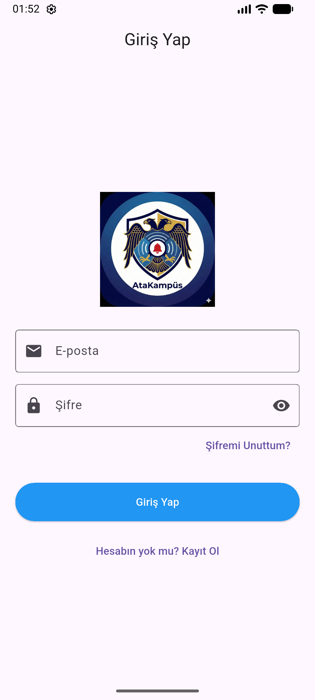
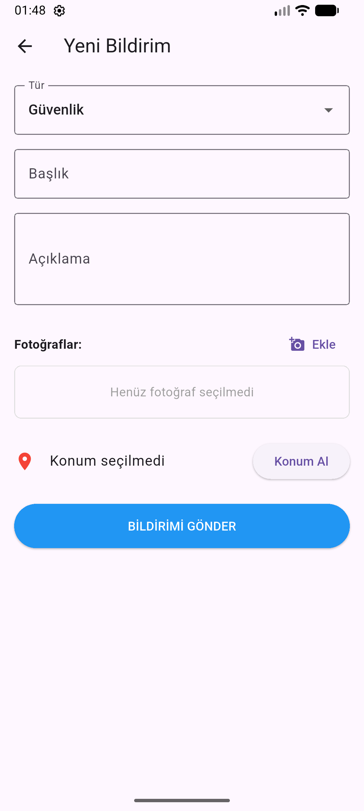
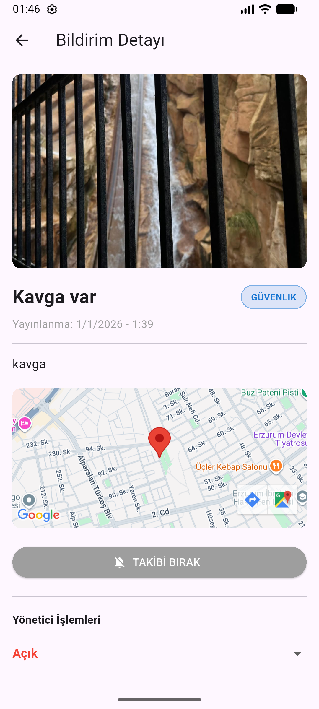

## Campus Security & Incident Reporting App 🛡️

## Project Overview
This is a mobile application developed with **Flutter** to improve safety and communication within the university campus. The app allows users to quickly report incidents (such as security issues, health emergencies, or technical failures) and track their status in real-time.

**Note:** This project was **co-developed** as a team effort.
* **Original Repository:** https://github.com/akifensardoru/kampus_guvenlik
* **My Contribution:** I developed the **Login**, **About Us**, and **Incident Reporting** screens (Add Report & Detail views) and updated the **system settings**.

## Key Features

### User Module
* **Incident Reporting:** Users can report issues with photos, descriptions, and location data.
* **Interactive Map:** View incidents on a map with category-specific pins.
* **Tracking:** Filter reports (Open, Resolved) and track status changes.
* **Profile:** Manage user details and notification settings.

### Admin Module
* **Incident Management:** Admins can view all reports and update their status (Open → Reviewing → Resolved).
* **Emergency Alerts:** Send instant emergency notifications to all users.
* **Dashboard:** Monitor all campus activities from a single screen.

## Technologies Used
* **Framework:** Flutter (Dart)
* **Backend:** Firebase (Auth, Firestore, Storage)
* **Maps:** Google Maps API

## 📸 Screenshots

| Login Screen | Add Report | Report Detail |
| :---: | :---: | :---: | :---: |
|  |  |  |

## How to Run
1.  Clone the project:
    ```bash
    git clone [https://github.com/ahmettolgasamikiran/kampus_guvenlik.git](https://github.com/ahmettolgasamikiran/kampus_guvenlik.git)
    ```
2.  Install dependencies:
    ```bash
    flutter pub get
    ```
3.  Run the app:
    ```bash
    flutter run
    ```

## Contributors
* **Ahmet Tolga SAMIKIRAN** - https://github.com/ahmettolgasamikiran
* **Akif Ensar DORU** - https://github.com/akifensardoru

---
*This project is created for educational purposes.*
